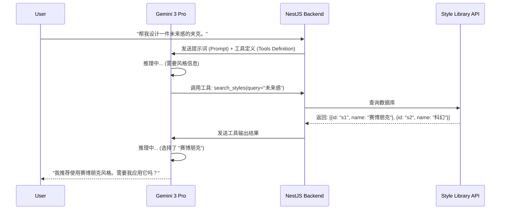
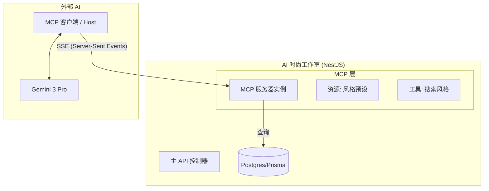

# Gemini 3 Pro MCP 集成与风格库分析报告

> **日期:** 2026-01-08
> **主题:** Gemini 3 Pro 函数调用能力与模型上下文协议 (MCP) 集成策略
> **背景:** 将 AI 时尚工作室 (AI Fashion Studio) 的“风格库”与 Gemini 3 Pro 进行集成。

## 1. 执行摘要

本报告分析了 **Gemini 3 Pro** 的高级函数调用能力以及 **Model Context Protocol (MCP)** 标准。目标是设计一个稳健的架构，使 Gemini 3 Pro 能够主动“发现”、“查询”并“利用” AI 时尚工作室中的风格资源。

通过将风格库封装为 MCP 服务器 (MCP Server)，我们将静态的数据库记录转化为 AI 代理 (Agent) 可以利用的主动工具，从而提升创意生成的质量。

---

## 2. Gemini 3 Pro 函数调用能力

Gemini 3 Pro 代表了代理式 AI (Agentic AI) 的重大飞跃，具有专为工具使用和系统集成设计的特性。

### 核心特性
1.  **原生 OpenAPI Schema:** 函数声明遵循标准的 OpenAPI 格式，确保严格的类型检查和可预测的载荷。
2.  **多模态响应:** 模型不仅能处理文本，还能处理包含图像、PDF 或其他媒体的函数输出。这对于风格迁移等视觉任务至关重要。
3.  **流式参数 (Streaming Arguments):** Gemini 3 Pro 支持 `streamFunctionCallArguments`，允许应用程序在完整的 JSON 生成之前就对模型的意图做出反应（从而降低延迟）。
4.  **思维签名 (Thought Signatures) & 推理:** 模型会发出加密的“思维签名”，以在多轮工具调用中保持推理链的连贯性。
5.  **并行与顺序执行:** 它可以在单轮对话中链式调用多个函数（例如：“搜索赛博朋克风格” -> “将其应用到这张图片”）。

### 函数调用流程


---

## 3. 模型上下文协议 (MCP) 架构

MCP 是一个开放标准，旨在统一 AI 代理连接数据和工具的方式。我们不再需要为每个模型硬编码 API 集成，而是构建一个 **MCP 服务器**。

### 关键概念
*   **资源 (Resources):** 模型可以读取的被动数据源（例如：文件系统、数据库记录）。
    *   *示例:* `style-library://presets/list`
*   **工具 (Tools):** 执行动作或复杂查询的可执行函数。
    *   *示例:* `search_styles(tag="复古")`
*   **提示词 (Prompts):** 帮助模型有效使用工具的可复用模板。

### AI 时尚工作室的建议架构

我们将现有的 NestJS 后端中嵌入实现一个 MCP 服务器。



---

## 4. 实施策略：风格库作为 MCP

我们将通过两个主要的 MCP 原语向 Gemini 3 Pro 暴露风格库。

### A. 资源 (Resource): 知识库
我们定义一个资源来列出可用的风格。这给 AI 提供了一个“菜单”，让它知道有哪些风格可用。

*   **URI:** `style-library://presets`
*   **MIME 类型:** `application/json`
*   **内容:** 包含元数据（名称、描述、标签）的风格预设 JSON 列表。

### B. 工具 (Tool): 主动搜索
我们定义一个工具，允许 AI 根据用户意图对风格进行模糊搜索。

*   **工具名称:** `search_style_presets`
*   **描述:** "根据关键词（如“复古”、“赛博朋克”或“水彩”）搜索视觉风格预设。"
*   **输入 Schema:**
    ```json
    {
      "type": "object",
      "properties": {
        "query": { "type": "string", "description": "风格关键词或描述" },
        "limit": { "type": "integer", "default": 5 }
      }
    }
    ```

### 集成工作流

1.  **发现:** 当后端通过 Gemini 初始化聊天会话时，它会连接到本地 MCP 服务器。
2.  **上下文加载:** Gemini 会在上下文中看到 `search_style_presets` 工具可用。
3.  **用户请求:** 用户说：“把这张图做成 90 年代动漫的样子。”
4.  **执行:**
    *   Gemini 调用 `search_style_presets("90s anime")`。
    *   MCP 服务器执行 Prisma 查询。
    *   MCP 服务器返回“复古动漫”预设的详情（包含生成所需的 `style_id`）。
5.  **应用:** Gemini 回复：“我找到了‘复古动漫’风格。正在应用...”并生成包含正确 `style_id` 的任务载荷。

---

## 5. 方案优势

| 特性 | 直接 API 调用 | MCP 实现 |
| :--- | :--- | :--- |
| **扩展性** | 难以添加新工具；每个模型都需要修改代码。 | **标准化**；添加一次工具，任何兼容 MCP 的模型均可使用。 |
| **上下文** | 模型依赖于提示词上下文（有限）。 | 模型可以**主动查询**海量数据库。 |
| **可移植性** | 锁定于特定的模型 API。 | **厂商中立**；可在 Gemini, Claude 或其他模型间轻松切换。 |
| **维护性** | 逻辑分散在控制器中。 | 逻辑封装在 **MCP 能力** (Capabilities) 中。 |

## 6. 结论与后续步骤

将 MCP 与 Gemini 3 Pro 集成，将使 AI 时尚工作室从被动工具转变为智能协作伙伴。建议的路径如下：

1.  **安装** `@modelcontextprotocol/sdk` 到 NestJS 服务器。
2.  **创建** `StyleMCPServer` 类来封装现有的 `StylePresetService`。
3.  **暴露** MCP SSE 端点于 `/api/mcp/sse`。
4.  **连接** 标准 Gemini 聊天接口到此 MCP 客户端。

这为未来的功能（如“人脸库”访问或“自动提示优化”工具）奠定了基础。
